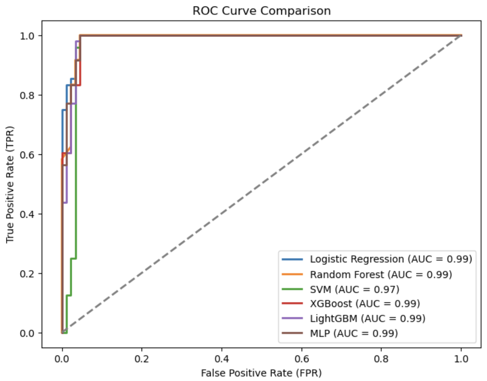
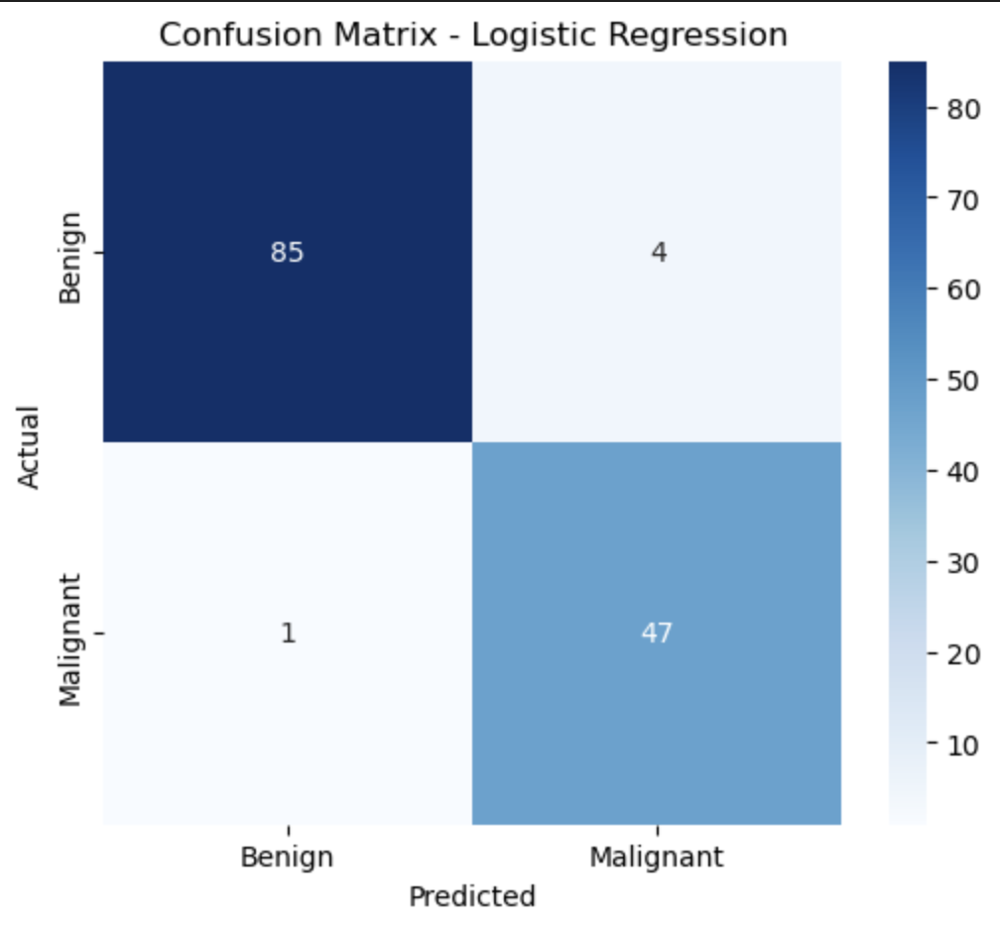
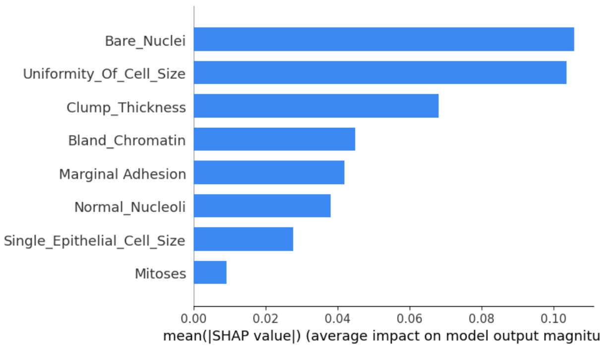
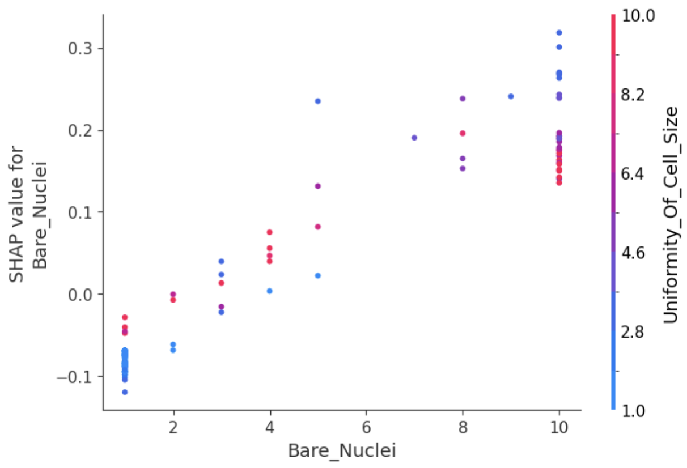
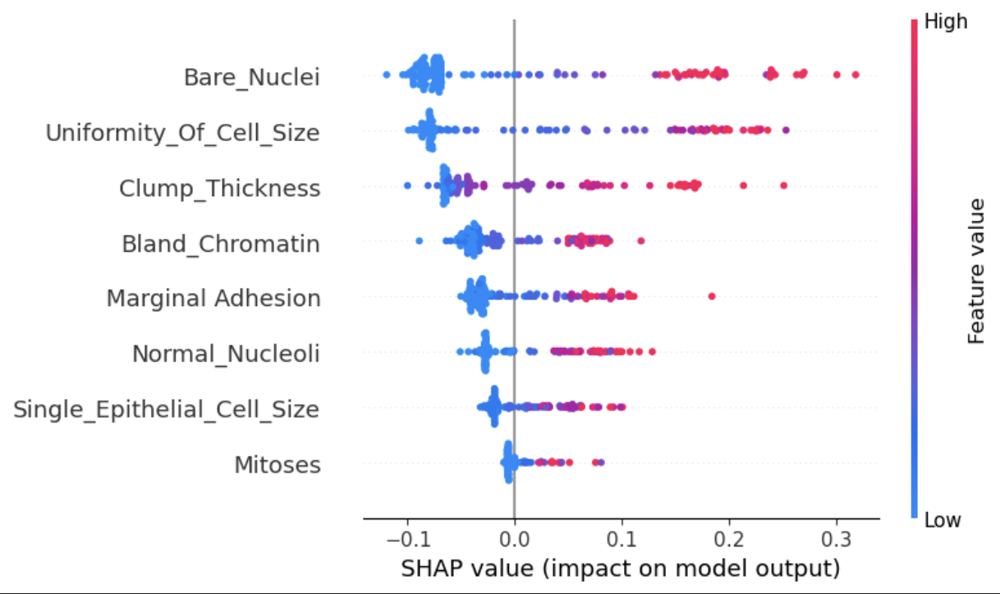

# **Breast Cancer Classification using Machine Learning**

## 📌 Project Overview  
This project applies various machine learning models to classify **breast cancer tumors** as **malignant (cancerous) or benign (non-cancerous)** using a publicly available dataset. The focus is on **model performance, feature importance, and explainability** using SHAP (SHapley Additive exPlanations).

## 🏆 Key Highlights  
✅ **Models Used:** Logistic Regression, Random Forest, SVM, XGBoost, LightGBM, MLP (Neural Network)  
✅ **Best Model:** Logistic Regression (AUC = 0.9927)  
✅ **Explainability:** SHAP Analysis to interpret feature importance  
✅ **Dataset:** Breast cancer cell data with 8 key features  
✅ **Evaluation Metrics:** Accuracy, AUC, ROC Curve, Confusion Matrix  

---

## ⚙️ Machine Learning Pipeline  
1️⃣ **Data Preprocessing**  
   - Handled missing values (`Bare_Nuclei` contained `?` values)  
   - Standardized numerical features  
   - Split dataset into **training (80%) and testing (20%)**  

2️⃣ **Model Training & Tuning**  
   - Used **GridSearchCV** for hyperparameter tuning  
   - Evaluated models using **Accuracy & AUC**  

3️⃣ **Model Evaluation**  
   - Compared performance using **ROC Curves & Confusion Matrices**  
   - Identified best-performing model: **Logistic Regression**  

---

## 📊 Dataset Information  
- The dataset consists of **breast cancer cell features** extracted from microscopic images.  
- Features include:  
  - `Bare_Nuclei` – Most influential feature in predicting malignancy  
  - `Clump_Thickness`, `Uniformity_Of_Cell_Size`, `Bland_Chromatin`, etc.  
- **Target Variable:**  
  - `0` → Benign Tumor  
  - `1` → Malignant Tumor  

---

## 📈 Model Performance  
| **Model** | **Accuracy** | **AUC** |  
|-----------|-------------|---------|  
| Logistic Regression | **96.35%** | **0.9927** |  
| Random Forest | 96.35% | 0.9850 |  
| SVM | 95.62% | 0.9700 |  
| XGBoost | **97.08%** | 0.9874 |  
| LightGBM | 95.62% | 0.9864 |  
| MLP | 94.89% | **0.9899** |  

🔹 **ROC Curve Comparison** (Higher AUC means better classification):  

---

### **Confusion Matrices** (Compare Model Performance)  
<table>
  <tr>
    <td align="center"><b>Logistic Regression</b></td>
    <td align="center"><b>Random Forest</b></td>
  </tr>
  <tr>
    <td></td>
    <td></td>
  </tr>
</table>

---

## 🛠️ SHAP Analysis - Feature Importance (Malignant Tumors)  
📌 **SHAP analysis helps explain how each feature impacts the model's decision.**  

### **🔍 Feature Importance & Dependence**  
<table>
  <tr>
    <td align="center"><b>SHAP Feature Importance</b></td>
    <td align="center"><b>SHAP Dependence - Bare Nuclei</b></td>
  </tr>
  <tr>
    <td></td>
    <td></td>
  </tr>
</table>

### **🔍 SHAP Summary Plot**  
📌 **The higher the SHAP value, the stronger the feature's influence on malignancy classification.**  

---

## 🚀 Next Steps / Potential Improvements  
- **Add more advanced models** (e.g., Transformer-based models for tabular data)  
- **Use feature engineering techniques** (e.g., PCA, additional domain knowledge features)  
- **Deploy as a web app** (Streamlit / Flask API for real-time predictions)  

---

## 🏆 Key Takeaways  
✅ **Logistic Regression is the best-performing model (AUC = 0.9927).**  
✅ **SHAP analysis confirms `Bare_Nuclei` as the most critical feature.**  
✅ **Feature interactions (e.g., `Bare_Nuclei` & `Uniformity_Of_Cell_Size`) are important for prediction.**  
  

---
## 📂 Repository Structure  
| File/Folder             | Description                                      |
|-------------------------|--------------------------------------------------|
| 📂 src                 | Contains all core scripts                        |
| 📂 visualizations      | Stores generated plots & SHAP analysis images    |
| 📄 requirements.txt    | Python dependencies                              |
| 📄 README.md           | Project documentation                           |
| 📄 .gitignore          | Ignore unnecessary files                         |
| 📄 breast_cancer_classification_with_shap.ipynb | Main Jupyter Notebook |
